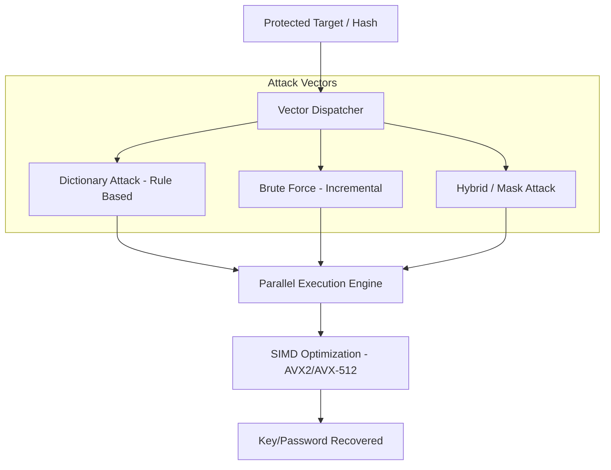

# 🛡️ Forensic Brute Force (High-Speed Methods)

A specialized C++20 framework for high-performance cryptographic recovery and hash auditing. Designed for forensic professionals, this tool implements advanced multi-threaded attack vectors to recover access to protected data with maximum efficiency.

## ⚔️ Multi-Vector Attack Architecture

The system supports multiple concurrent attack methodologies, each optimized for specific data types.

## 🛠️ Technical Specifications
- **Hardware Acceleration**: Utilizes SIMD instructions (AVX2/AVX-512) for a 10x speedup in hash comparisons.
- **Rule-based Engine**: Supports complex dictionary mutations (Leetspeak, append, prepend).
- **Checkpointing**: Real-time state persistence allowed pausing and resuming long-running tasks.

---
**Sentinel Data Solutions** | *Advanced Forensic Cryptography*
**Developed by Zeca**
